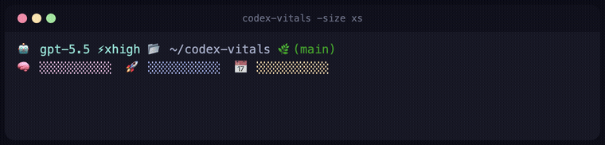
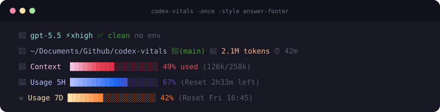

<div align="center">

# 🫀 codex-vitals

**A lightweight Go panel for OpenAI Codex CLI sessions**
See model, reasoning effort, git status, working directory, context usage, and 5-hour / weekly usage limits at a glance.

[English](./README.md) · [한국어](./README.ko.md)

[Quick install](#-quick-install) · [Sizes](#-sizes) · [What it shows](#-what-it-shows) · [Options](#-options) · [FAQ](#-faq)


<br/>


</div>

---

## ✨ Highlights

- 🤖 **Current model / effort** — shows the latest turn info from your Codex session, e.g. `gpt-5.5 ⚡xhigh`.
- 🧠 **Accurate context %** — reads token usage from the Codex rollout and computes context-window usage that matches Codex's own status line (see [Context %](#-context--calculation)).
- 📊 **5H / 7D usage bars** — 5-hour and weekly rate-limit usage with reset times.
- 🌿 **Git status** — current branch, dirty count, and clean state.
- 🎨 **Terminal colors** — ANSI truecolor with gradient block bars.
- 🪶 **Small single binary** — written in Go, runs without a Node runtime.

---

## 🚀 Quick install

### One line (macOS / Linux)

```bash
curl -fsSL https://raw.githubusercontent.com/WinningBean/codex-vitals/main/install.sh | bash
```

Downloads the prebuilt binary for your OS/arch into `~/.local/bin` (falls back to building from source if no release is published yet).

Pick a default size in the same command (`xs`, `s`, `m`, `l`, `xl`):

```bash
curl -fsSL https://raw.githubusercontent.com/WinningBean/codex-vitals/main/install.sh | bash -s -- xl
```

This writes the size to `~/.config/codex-vitals/size`, which the panel re-reads every second — so a **running panel switches size live**, no restart or shell reload. Re-run with a different size any time to change it. A `-size` flag still overrides it for a single run.

### `go install`

Easiest if you have Go 1.22+:

```bash
go install github.com/WinningBean/codex-vitals/cmd/codex-vitals@latest
```

Make sure `$GOPATH/bin` (or `$HOME/go/bin`) is on your `PATH`, then:

```bash
codex-vitals -once -context-mode patched -size l
```

### Build from source

```bash
git clone https://github.com/WinningBean/codex-vitals.git
cd codex-vitals
CGO_ENABLED=0 go build -o codex-vitals ./cmd/codex-vitals
./codex-vitals -once -context-mode patched -size l
```

### Run during local development

```bash
go run ./cmd/codex-vitals -once
go run ./cmd/codex-vitals -once -context-mode patched -size l
```

---

## 📐 Sizes

Pick how much the panel shows with `-size` (default `m`):

| Size | Lines | Shows |
|------|:-----:|-------|
| `xs` | 2 | model · path · branch · 3 tiny bars |
| `s`  | 2 | + labels and percentages |
| `m` (default) | 4 | model · git · env · full-width context bar |
| `l`  | 5 | + tokens, session time, reset times, 20-wide bars |
| `xl` | 5 | everything, 40-wide bars |

<div align="center"></div>

Colors show in a real terminal; GitHub may not render the ANSI colors in the text blocks below.

**`xs`**

```text
🤖 gpt-5.5 ⚡xhigh 📂 ~/Documents/Github/codex-vitals 🌿(main)
🧠 █████░░░░░  🚀 ███████░░░  📅 ████░░░░░░
```

**`s`**

```text
🤖 gpt-5.5 ⚡xhigh │ 📂 ~/Documents/Github/codex-vitals 🌿(main)
🧠 Context █████░░░░░ 49% │ 🚀 5H ███████░░░ 67% │ 📅 7D ████░░░░░░ 42%
```

**`m` (default)**

```text
🤖 gpt-5.5 ⚡xhigh │ ✅ clean │ no env
📂 ~/Documents/Github/codex-vitals 🌿(main)
🧠 Context  ████████████████░░░░░░░░░░░░░░░░░ 49% used
🚀 Usage 5H ███████░░░ 67% │ 📅 7D ████░░░░░░ 42%
```

**`l`**

```text
🤖 gpt-5.5 ⚡xhigh │ ✅ clean │ no env
📂 ~/Documents/Github/codex-vitals 🌿(main) │ 🧾 2.1M tokens │ ⏰ 42m
🧠 Context  ██████████░░░░░░░░░░ 49% used (126k/258k)
🚀 Usage 5H █████████████░░░░░░░ 67% (Reset 2h33m left)
📅 Usage 7D ████████░░░░░░░░░░░░ 42% (Reset Fri 16:45)
```

**`xl`**

```text
🤖 gpt-5.5 ⚡xhigh │ ✅ clean │ no env
📂 ~/Documents/Github/codex-vitals 🌿(main) │ 🧾 2.1M tokens │ ⏰ 42m
🧠 Context  ████████████████████░░░░░░░░░░░░░░░░░░░░ 49% used (126k/258k)
🚀 Usage 5H ███████████████████████████░░░░░░░░░░░░░ 67% (Reset 2h33m left)
📅 Usage 7D █████████████████░░░░░░░░░░░░░░░░░░░░░░░ 42% (Reset Fri 16:45)
```

```bash
codex-vitals -once -size xs   # or s, m, l, xl
```

---

## 🎨 What it shows

| Item | Meaning |
|------|---------|
| 🤖 **Model** | Latest model of the current Codex session |
| ⚡ **Effort** | Reasoning effort (`low`, `medium`, `high`, `xhigh`, …) |
| 📝 **Git dirty** | Number of tracked changed files, or clean state |
| 🐍 **Env** | Active `CONDA_DEFAULT_ENV` or `VIRTUAL_ENV` |
| 📂 **Path** | Working directory of the current session |
| 🌿 **Branch** | Current git branch |
| 🧾 **Tokens** | Cumulative session token usage |
| ⏰ **Time** | Elapsed time since the session started |
| 🧠 **Context** | Context-window usage percentage and token count |
| 🚀 **Usage 5H** | 5-hour usage limit and time to reset |
| 📅 **Usage 7D** | Weekly usage limit and reset time |

---

## 🧠 Context % calculation

`codex-vitals` offers two modes so it can match both stock Codex and a patched Codex build.

| Mode | Formula | Matches |
|------|---------|---------|
| `codex` (default) | `(total_tokens − 12000) / (model_context_window − 12000)` | stock Codex status line |
| `patched` | `(input_tokens + cached_input_tokens) / model_context_window` | a patched Codex build |

Stock Codex reserves a `12000`-token baseline (system prompt, tools, and room to run `/compact`), so the default `codex` mode subtracts `12000` from both `total_tokens` and `model_context_window`. For small models whose window is `≤ 12000`, it falls back to the raw bounded ratio so usage is never reported as a misleading `0%` or `100%`.

If the number doesn't match what Codex shows, you're probably on a patched Codex build — use `patched`:

```bash
codex-vitals -once -context-mode patched -size l
```

---

## ⚙️ Options

```text
-codex-home string
    Path to CODEX_HOME. Defaults to $CODEX_HOME or ~/.codex

-rollout string
    Use a specific rollout JSONL file directly

-context-mode string
    Context usage formula: codex or patched

-size string
    panel size: xs, s, m, l, xl
    (default: ~/.config/codex-vitals/size, then CODEX_VITALS_SIZE, then m)

-interval duration
    Refresh interval. Default 1s

-once
    Render once and exit

-no-color
    Output without ANSI colors
```

The default size lives in `~/.config/codex-vitals/size` (write it with the installer — see [Quick install](#-quick-install) — or `echo l > ~/.config/codex-vitals/size`). The panel re-reads it every second, so changing it updates a running panel live. `CODEX_VITALS_SIZE` works as a fallback, and the `-size` flag always overrides both.

---

## 🧪 Try it with a specific session

```bash
codex-vitals \
  -once \
  -rollout /path/to/session.jsonl \
  -context-mode patched \
  -size l
```

If colors look broken in your environment, add `--no-color`.

---

## 📁 Data read

By default it reads:

- `~/.codex/sessions/**/*.jsonl`
- `$CODEX_HOME/config.toml` / `~/.codex/config.toml`
- `session_meta`, `turn_context`, `token_count` from the rollout
- `primary` / `secondary` rate limits

It finds the most recent Codex session and renders it; use `-rollout` to pin a specific file.

---

## 🧩 Using it in tmux / as a footer

From inside a tmux session (e.g. where Codex is running), add a panel at the bottom:

```bash
scripts/tmux-panel.sh                 # size m, refreshing every 1s
scripts/tmux-panel.sh -size l
scripts/tmux-panel.sh -size xs
CODEX_VITALS_TMUX_HEIGHT=8 scripts/tmux-panel.sh -size xl
```

The pane height auto-fits the size; override it with `CODEX_VITALS_TMUX_HEIGHT`. Focus returns to your original pane; Ctrl+C in the panel closes it. Or run it directly:

```bash
# render once
codex-vitals -once -context-mode patched -size l

# refresh every second
codex-vitals -context-mode patched -size l -interval 1s

# no color, for logs / README
codex-vitals -once -context-mode patched -size l --no-color
```

---

## ✅ Requirements

| Item | Why |
|------|-----|
| Go 1.22+ | Build and `go install` |
| A Codex CLI session | `~/.codex/sessions` rollout data |
| git | Branch / dirty status |
| truecolor terminal | Gradient bar colors |

> With `--no-color`, text output works fine even without truecolor.

---

## 🧹 Uninstall

If installed via `go install`, just remove the binary:

```bash
rm "$(go env GOPATH)/bin/codex-vitals"
```

Built from source? Remove the binary you created:

```bash
rm ./codex-vitals
```

`codex-vitals` installs no daemon, launch agent, or shell-rc changes.

---

## 🙋 FAQ

**Colors don't show in the README or chat.**
Markdown / chat renderers usually don't interpret ANSI escapes as colors. Run it in a real terminal without `--no-color` to see them.

**The number differs slightly from what Codex shows.**
Rollouts update live, so token counts can shift by ~1k depending on when you run. To match Codex's own formula, use `-context-mode patched`.

**5H shows used, not left.**
The panel shows usage limits as used-percent (how much of the window you've spent) to match a running Codex build. Reset times are shown next to the `l` and `xl` bars.

**Do I need Node?**
No. `codex-vitals` itself is a Go binary.

**Do I need a Nerd Font?**
No. It uses standard emoji and Unicode block characters.

---

## Acknowledgements

- The persistent terminal-panel idea comes from [jarrodwatts/claude-hud](https://github.com/jarrodwatts/claude-hud) (for Claude Code).
- The layout and gradient bar were inspired by [AwesomeJun/CC-statusline](https://github.com/AwesomeJun/CC-statusline).
- Reads session data written by [openai/codex](https://github.com/openai/codex).

---

<div align="center">

Built for Codex users who want to see the real session vitals at a glance. 🫀

</div>
